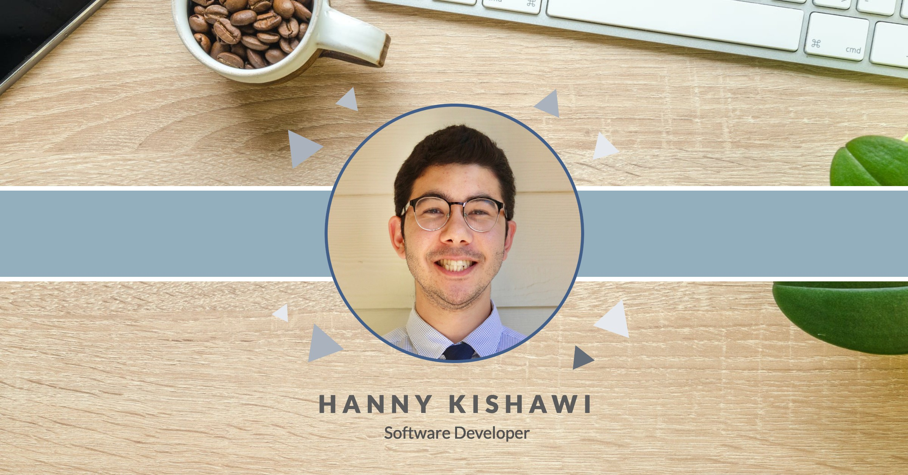

### Hi there 👋

### My name is Hanny Kishawi  
* 🔭  I'm a full-stack developer with a background in healthcare and who's currently looking for a full-time software dev position. 
* 🎸  When I'm not coding, I'm picking up some chords, exploring hiking trails in the area, or hanging out by the bonfire with family and friends
* ⚡  Fun fact: I'm a certified speech and language pathologist. and also a self-certified foodie 🌮🍹! 
* 🌱  I'm a life-long learner who's always happy to collaborate and meet new people 
* 😊 📫  Reach out to me on 
[LinkedIn](https://www.linkedin.com/in/hkishawi "Hanny's LinkedIn Profile") 

<h3>👨‍💻 Here are a few things I code with ☕</h3>

  
  
  
  
  
  
  
  
  
  
  
  
  
<!--
**hkishawi/hkishawi** is a ✨ _special_ ✨ repository because its `README.md` (this file) appears on your GitHub profile.

Here are some ideas to get you started:

 ...
 My dream occupation as a kid was to be wolverine, but now I'm a software engineer haha. ha. 
- 🌱 I’m currently learning ...
- 👯 I’m looking to collaborate on ...
- 🤔 I’m looking for help with ...
- 💬 Ask me about ...
- 📫 How to reach me: ...
- 😄 Pronouns: ...
- ⚡ Fun fact: ...
-->
